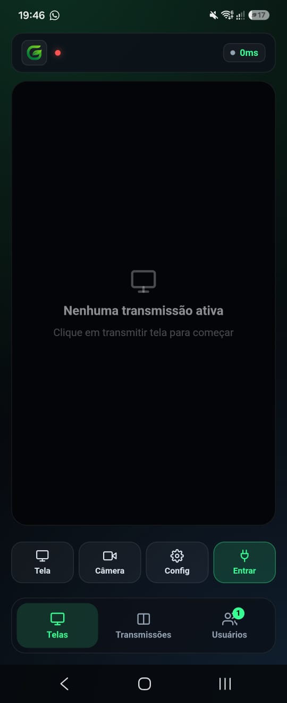

# GreenLabs Mobile

Cliente Android do [GreenLabs Live Streaming](https://github.com/gustavo-blacknaut/greenlabs-desktop).

Permite entrar nas salas pelo celular para **assistir** as transmissões,
transmitir a própria tela e participar com **câmera e microfone**.

> **Estável.** Testado em aparelho real: transmitir tela, câmera, microfone e
> entrar em sala funcionando.



---

## O que funciona (por design)

| Recurso | Android |
|---|---|
| Assistir transmissões | ✅ |
| Câmera | ✅ |
| Microfone | ✅ |
| Entrar em sala / servidor | ✅ |
| Transmitir a tela | ✅ (ver abaixo) |
| Áudio do sistema sem Discord | ❌ |

A exclusão de áudio depende de WASAPI, que só existe no Windows — isso não
tem como ser feito no Android por design.

### Como funciona o compartilhamento de tela

Nenhum navegador Android implementa `getDisplayMedia` — não é uma limitação
do WebView, é da plataforma inteira (confirmado no
[caniuse](https://caniuse.com/mdn-api_mediadevices_getdisplaymedia)). Então
esse recurso não vem do WebView: vem de `MediaProjection`, a API nativa que
o Discord/Zoom/Meet também usam.

```
MainActivity ──(Intent de permissão)──► sistema
     │
     ▼
ScreenCaptureService (foreground, tipo mediaProjection)
     │  MediaProjection → VirtualDisplay → ImageReader → JPEG
     ▼
ScreenStreamServer (http://127.0.0.1:<porta>/stream)
     │  frames JPEG enquadrados (4 bytes de tamanho + payload) - mesmo
     │  formato que o áudio WASAPI do app desktop já usa
     ▼
WebView: canvas + captureStream() → MediaStream real → addLocalStream()
```

O canvas é o que faz a ponte: os frames chegam por HTTP local, são
desenhados nele, e `canvas.captureStream()` devolve uma `MediaStream` de
verdade — a partir daí é o mesmo caminho de código que uma câmera usa, o
resto do WebRTC não precisa saber a diferença.

**A partir do Android 14, o sistema exige uma notificação persistente**
enquanto a tela está sendo compartilhada (mesma notificação chata que
Discord/Zoom mostram — não é opcional, é política da plataforma).

Qualidade é mais conservadora que no desktop: a captura fica limitada a
1280×720 e 15fps mesmo que uma resolução maior esteja selecionada, porque
cada frame é codificado em JPEG por software — sem isso o consumo de
CPU/bateria explode rápido num celular.

---

## Como funciona

O app é um WebView que carrega o mesmo cliente React do desktop, servido
localmente:

```
┌─────────────────────────────────────────┐
│  MainActivity (WebView)                 │
│                                         │
│   http://127.0.0.1:47869                │
│                    ▲                    │
│                    │                    │
│   AssetHttpServer ─┘                    │
│   serve app/src/main/assets/web/        │
└─────────────────────────────────────────┘
                    │
              WebRTC + ws://
                    ▼
         servidor de sinalização
```

### Por que um servidor HTTP local

Foi a única das três opções que atende os dois requisitos ao mesmo tempo:

| Origem | `getUserMedia` | `ws://` para a LAN |
|---|---|---|
| `file://` | ❌ não é secure context | ✅ |
| `https://appassets.androidplatform.net` | ✅ | ❌ mixed content bloqueia |
| **`http://127.0.0.1`** | ✅ exceção de loopback | ✅ |

O `AssetHttpServer` é um servidor mínimo (~180 linhas, sem dependências) que
serve os arquivos de `assets/web/`. A porta é fixa de propósito: `localStorage`
é preso à origem, e a porta faz parte dela — uma porta nova a cada abertura
significaria perder as configurações salvas toda vez.

---

## Compilando

```bash
./gradlew assembleDebug
```

O APK sai em `app/build/outputs/apk/debug/`.

Para release, assinado e minificado:

```bash
./gradlew assembleRelease
```

Isso exige uma keystore em `keystore/greenlabs-release.jks` referenciada por
`keystore/keystore.properties` (nenhum dos dois vai pro git — sem eles o
`signingConfig` é pulado e o build falha na assinatura). Para gerar a sua:

```bash
keytool -genkeypair -v -keystore keystore/greenlabs-release.jks \
  -alias greenlabs -keyalg RSA -keysize 2048 -validity 10950
```

E crie `keystore/keystore.properties`:

```properties
storeFile=greenlabs-release.jks
storePassword=SUA_SENHA
keyAlias=greenlabs
keyPassword=SUA_SENHA
```

> Guarde essa keystore em lugar seguro. Perdê-la significa não conseguir mais
> publicar atualizações assinadas com a mesma chave — quem já instalou o app
> não consegue atualizar por cima, só desinstalar e reinstalar.

### Atualizando o cliente web

Os arquivos em `app/src/main/assets/web/` são o build do repositório principal.
Para atualizar:

```bash
# no repositório greenlabs-desktop
npm run build

# copie dist/ para cá
cp -r dist/. ../greenlabsapp/app/src/main/assets/web/
```

---

## Permissões

| Permissão | Motivo |
|---|---|
| `INTERNET` | conectar no servidor de sinalização e nos peers |
| `ACCESS_NETWORK_STATE` | detectar rede disponível |
| `CAMERA` | transmitir vídeo |
| `RECORD_AUDIO` | transmitir voz |
| `MODIFY_AUDIO_SETTINGS` | roteamento de áudio em chamada |
| `FOREGROUND_SERVICE` / `FOREGROUND_SERVICE_MEDIA_PROJECTION` | exigidas pelo Android para captura de tela em segundo plano |
| `POST_NOTIFICATIONS` | mostrar a notificação obrigatória durante o compartilhamento de tela (Android 13+) |

`usesCleartextTraffic="true"` é necessário porque o app usa `http://127.0.0.1`
internamente e `ws://` para servidores na rede local.

Câmera e microfone são pedidos em tempo de execução na primeira abertura. Sem
eles o app ainda funciona, mas só para assistir.

---

## O que falta

- [x] Testar o APK em aparelho real — testado; áudio, layout e captura de
      tela renderam problemas reais que foram corrigidos nas versões 1.0.1+
- [x] Confirmar compartilhar tela num aparelho real
- [ ] Verificar WebRTC no WebView em versões diferentes do Android
- [x] Ícone próprio

---

## Requisitos

- Android 7.0 (API 24) ou superior
- WebView atualizado (vem pela Play Store na maioria dos aparelhos)

---

## Changelog

O que mudou em cada versão está no [CHANGELOG.md](CHANGELOG.md).

## Créditos

Faz parte do projeto [GreenLabs Live Streaming](https://github.com/gustavo-blacknaut/greenlabs-desktop).
